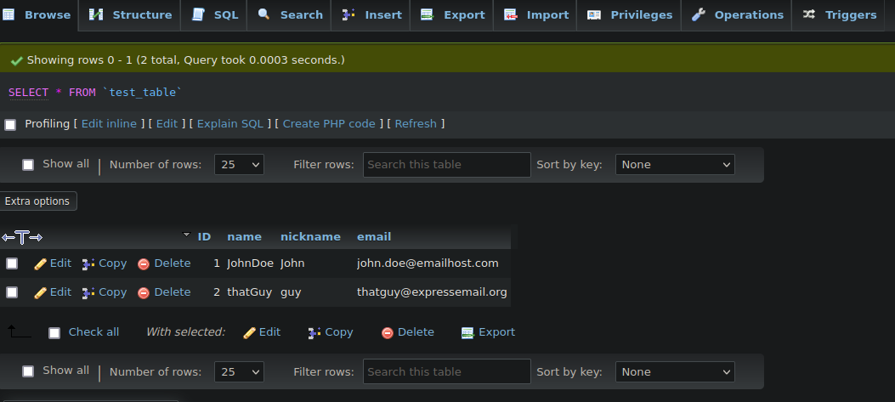

# TP - 1 Docker
### ROUGEON Corentin B3 DATA/IA
 
 

### 5. Exécuter un serveur web dans un conteneur docker :

`docker run -d -p 80:80 nginx`

#### a. Récupérer l’image sur le Docker Hub

pour récupérer l'image il, faut tout d'abord lister nos images avec 
`docker images` :

    REPOSITORY    TAG       IMAGE ID       CREATED         SIZE
    ubuntu        latest    6b7dfa7e8fdb   4 days ago      77.8MB
    nginx         latest    ac8efec875ce   7 days ago      142MB
    hello-world   latest    feb5d9fea6a5   14 months ago   13.3kB

on peux voir notre image de serveur web `nginx` avec le tag `latest`

pour récupérer l'image, on execute
`docker pull nginx:latest` :

    latest: Pulling from library/nginx
    Digest: sha256:ab589a3c466e347b1c0573be23356676df90cd7ce2dbf6ec332a5f0a8b5e59db
    Status: Image is up to date for nginx:latest
    docker.io/library/nginx:latest

 

#### b. Vérifier que cette image est présente en local

pour verifier et lister nos images locaux, on execute 
`sudo docker image ls` :

    REPOSITORY    TAG       IMAGE ID       CREATED         SIZE
    ubuntu        latest    6b7dfa7e8fdb   4 days ago      77.8MB
    nginx         latest    ac8efec875ce   7 days ago      142MB
    hello-world   latest    feb5d9fea6a5   14 months ago   13.3kB

on peux voir que notre image serveur web est bien présent en local

 

#### c. Créer un fichier index.html simple

`nano ~/docker-html/index.html` :

    <header>
            this is my page
    </header>
    <body>
            hello world
    </body>

 

#### d. Démarrer un conteneur et servir la page html créée précédemment à l’aide d’un volume

verification de la présence du fichier html :

`john@ubuntu:~/docker-html$ ls -l`

    total 4
    -rw-r--r-- 1 root root 64 Dec 13 02:03 index.html

execution de `docker run` lors situer dans le dossier qui contient le fichier
html :

`sudo docker run -p 80:80 -v $(pwd):/usr/share/nginx/html nginx`

resultat `curl localhost` :

    <header>
        this is my page
    </header>
    <body>
	    hello world
    </body>

 

#### e. Supprimer le conteneur précédent et arriver au même résultat que précédemment à l’aide de la commande docker cp

pour lister les conteneurs on utilise `docker ps` :

    CONTAINER ID   IMAGE     COMMAND                  CREATED         STATUS         PORTS                               NAMES
    68da455a656c   nginx     "/docker-entrypoint.…"   6 minutes ago   Up 6 minutes   0.0.0.0:80->80/tcp, :::80->80/tcp   romantic_goldstine

on peux voir que notre conteneur nginx a une id de `68da455a656c`

pour supprimer le conteneur on execute `docker kill [container id]` :

`docker kill 68da455a656c`

afin de copier nos fichier dans une nouveau container, on execute `docker run -d -p 80:80 nginx`

et pour copier notre fichier html dans notre machine local
vers notre container, on fait `docker cp [SRC PATH] [DOCKERID]:[DEST PATH]` :

`docker cp ~/docker-html/index.html b33940b08711:/usr/share/nginx/html`

resultat `curl localhost` :

    <header>
        this is my page
    </header>
    <body>
	    hello world
    </body>

 

### 6. Builder une image

#### a. A l’aide d’un Dockerfile, créer une image
avec `nano dockerfile` on crée notre dockerfile:

    FROM nginx:latest
    COPY index.html /usr/share/nginx/html/

pour crée notre docker on execute `docker build -t tp-docker .`

resultat de `docker images` :

    REPOSITORY    TAG       IMAGE ID       CREATED         SIZE
    tp-docker     latest    a3e8e3669fe4   6 minutes ago   142MB
    ubuntu        latest    6b7dfa7e8fdb   10 days ago     77.8MB
    nginx         latest    ac8efec875ce   13 days ago     142MB
    hello-world   latest    feb5d9fea6a5   15 months ago   13.3kB

on constate que notre image a bien été build
 

#### b. Exécuter cette nouvelle image de manière à servir la page html

on run notre image avec `docker run -d -p 80:80 tp-docker` 

resultat `curl localhost` :

    <header>
        this is my page
    </header>
    <body>
        hello world
    </body>

#### c. Quelles différences observez-vous entre les procédures 5. et 6.

la methode 5. est une methode manuel, ils autorise a faire des
modification a des container sans faire de modification a une image

la methode 6. est une methode automatique, ils autorise a sauvegarder
l'image pour pouvoir le run et le metre en sercive automatiquement,
cette methode permet aussi à versionner et upload l'image facilement

 

### 7. Utiliser une base de données dans un conteneur docker

#### a. Récupérer les images mysql:5.7 et phpmyadmin/phpmyadmin

pour récuperer l'immage msql:5.7 : `docker pull mysql:5.7`

pour récuperer l'image : `docker pull phpmyadmin/phpmyadmin`

resultat `docker image ls` :

    REPOSITORY              TAG       IMAGE ID       CREATED         SIZE
    tp-docker               latest    a3e8e3669fe4   23 hours ago    142MB
    ubuntu                  latest    6b7dfa7e8fdb   11 days ago     77.8MB
    mysql                   5.7       d410f4167eea   13 days ago     495MB
    nginx                   latest    ac8efec875ce   2 weeks ago     142MB
    phpmyadmin/phpmyadmin   latest    4a4023c7e22a   7 months ago    510MB
    hello-world             latest    feb5d9fea6a5   15 months ago   13.3kB

 

#### b. Exécuter deux conteneurs à partir des images et ajouter une table ainsi que quelques enregistrements dans la base de données à l’aide de phpmyadmin

pour executer le conteneur mysql : 

`docker run --name some-mysql -e MYSQL_ROOT_PASSWORD=themagicword -d mysql:5.7`

`-e` va nous permetre de configurer les variables environnement du
conteneur ( come le mot de passe mysql `MYSQL_ROOT_PASSWORD` )

pour executer le conteneur mysql :

`sudo docker run --name myadmin -d --link some-mysql:db -p 8080:80 phpmyadmin/phpmyadmin`

`--link` va permetre de lier notre base de donnée de notre conteneur 
mysql a notre conteneur phpmyadmin

ajout d'une table dans une base de données sur phpmyadmin 
(avec quelques variables) :

verification d'ajout de données sur mysql :

`docker exec -it 707114c35819 mysql -pthemagicword`

resultat `select * from db_tp.test_table;` :

    +----+---------+----------+--------------------------+
    | ID | name    | nickname | email                    |
    +----+---------+----------+--------------------------+
    |  1 | JohnDoe | John     | john.doe@emailhost.com   |
    |  2 | thatGuy | guy      | thatguy@expressemail.org |
    +----+---------+----------+--------------------------+

